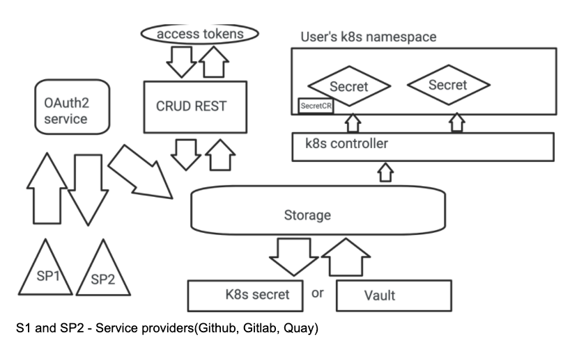

# Managed Service Provider Integration
Managing access to the third-party service providers

# Goals and Requirements

 - Provide a single home for managing service providers and authorization to them.
 - Allow individual tools/services to easily request authorization.
 - Allow easy consumption by workloads, e.g. provisioning secrets following existing patterns.
 - Integration with common providers, starting with git & container registries (see below).
 - Ability to revoke the authorization (e.g. removed user or expired token).
 - Ability to move authorization to match the workload (e.g. build is moved to a different namespace or cluster).
 - Any secrets at rest must be securely stored in a vault.

# Integrations
 - Github
 - Quay

# Architecture 
Services are going to have 4 major components.
 - **Product frontend**  - responsible for visual interaction with the user, listing and managing existing service provider authorizations, access tokens. Managing token scope, sharing, etc.
 - **Product backend** - responsible for CRUD operation with personal access tokens, OAuth2 routine between service providers and our service.
 - **Cluster Backend** - Kubernetes controller - responsible for injecting personal access tokens in user’s namespace for workload consumption.
 - **Permanent storage** - responsible for permanent keeping of sensitive data.

